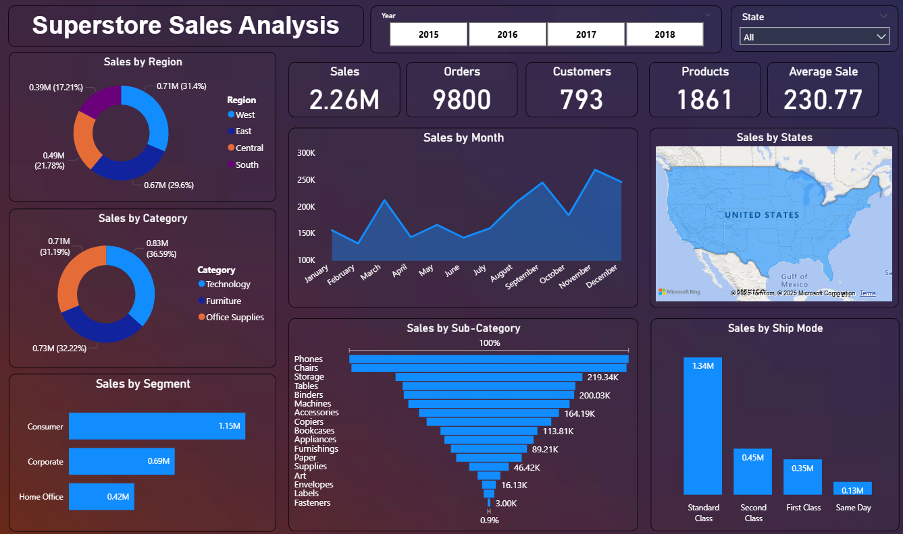

# 📊 Superstore Sales Analysis Dashboard

## 📌 Overview
This project analyzes sales data from a Superstore to provide insights into revenue, customer behavior, product categories, and shipping modes.
A dashboard was created for interactive exploration and better business understanding.

---

## 🗂 Dataset
- **File**: `Superstore_Sales_Analysis.csv`  
- Includes sales transactions with attributes like region, category, segment, ship mode, and state.

---

## 📸 Dashboard Preview

---

## 📊 Visualization
- **Sales by Region, Category, Segment**
- **Monthly Sales Trends**
- **Top Sub-Category Sales**
- **Sales by Ship Mode**
- **Geographical Sales by States**

---

## 🎯 Insights
- Highest sales from **Technology** category.
- **East region** leads in sales.
- **Consumer segment** is the largest contributor.
- **Standard Class** shipping dominates.
